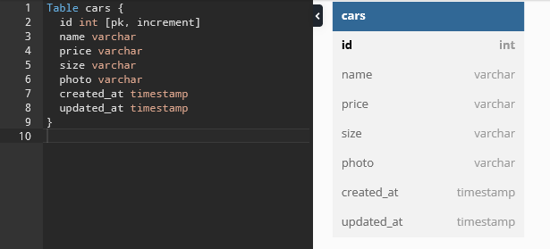

# Binar Challenge Chapter 5

### Diagram



## Router Endpoint

## API-Docs
- Swagger UI link : [http://localhost:8005/api-docs/]

## CARS

### GET :
- "/api/cars" : get all cars

Response

```json
{
  "data": [
    {
      "id": 1,
      "name": "Toyota Avanza",
      "price": "450000",
      "size": "Large",
      "photo": "https://res.cloudinary.com/dktlknmoi/image/upload/v1669021089/htemn9q3kxqxmyusjssu.png",
      "createdAt": "2022-11-21T08:58:03.886Z",
      "updatedAt": "2022-11-21T08:58:03.886Z"
    },
    {
      "id": 2,
      "name": "Honda Civic",
      "price": "500000",
      "size": "Medium",
      "photo": "https://res.cloudinary.com/dktlknmoi/image/upload/v1669022211/amfa5inj5936pce6kjwc.png",
      "createdAt": "2022-11-21T09:16:45.706Z",
      "updatedAt": "2022-11-21T09:16:45.706Z"
    },
    {
      "id": 3,
      "name": "Honda Jazz",
      "price": "400000",
      "size": "Small",
      "photo": "https://res.cloudinary.com/dktlknmoi/image/upload/v1669022261/e1ddkjkjn516vx6ccrlz.jpg",
      "createdAt": "2022-11-21T09:17:36.079Z",
      "updatedAt": "2022-11-21T09:17:36.079Z"
    },
    {
      "id": 4,
      "name": "Suzuki Carry",
      "price": "300000",
      "size": "Small",
      "photo": "https://res.cloudinary.com/dktlknmoi/image/upload/v1669022683/oq6sw5qbna32rsh3qt1b.jpg",
      "createdAt": "2022-11-21T09:24:37.906Z",
      "updatedAt": "2022-11-21T09:24:37.906Z"
    }
  ]
}
```

- "/api/cars/:id" : get cars by id

Request

id = 2
../api/cars/2

Response

```json
{
  "data": {
    "id": 2,
    "name": "Honda Civic",
    "price": "500000",
    "size": "Medium",
    "photo": "https://res.cloudinary.com/dktlknmoi/image/upload/v1669022211/amfa5inj5936pce6kjwc.png",
    "createdAt": "2022-11-21T09:16:45.706Z",
    "updatedAt": "2022-11-21T09:16:45.706Z"
  }
}
```

### POST :
- "/api/cars" : insert car

Request

```json
{
    "name": "Suzuki Carry",
    "prize": "300000",
    "size": "Small",
    "photo": "../carry.jpeg"
}
```

Response

```json
{
  "message": "Car added",
  "body": {
    "name": "Suzuki Carry",
    "price": "300000",
    "size": "Small"
  }
}
```

### PUT :
- "/api/cars/:id" : update car by id

Request

../api/cars/6
```json
{
    "name": "Wuling Almaz",
    "prize": "400000",
    "size": "Large",
    "photo": "../wuling-almaz-rs.png"
}
```

Response

```json
{
  "message": "Car updated",
  "data": [
    1
  ]
}
```

### DELETE :
- "/api/cars/:id" : delete car by id

Request

id = 7
../api/cars/7

Response

```json
{
  "message": "Car deleted"
}
```

## USER

### REGISTER MEMBER
### REGISTER ADMIN
### LOGIN
### CURRENT USER/PROFILE


## NOTE
Case :
- Terdapat endpoint untuk menambahkan admin yang mana hanya boleh dilakukan
oleh superadmin : Not fully implemented

Saya agak kurang yakin dengan cara implementasi bagian ini. Di pikiran saya, kita perlu membuat akun superadmin secara manual melalui database langsung ataupun dengan endpoint. Tapi jika saya membuat endpoint untuk 'create superadmin account', rasanya berlawanan dengan purpose/tujuan dari case tersebut. Sehingga pada bagian case ini saya hanya membuat endpoint 'registrasi member' dan 'registrasi admin', dengan anggapan untuk membuat akun admin perlu authorization dari superadmin.