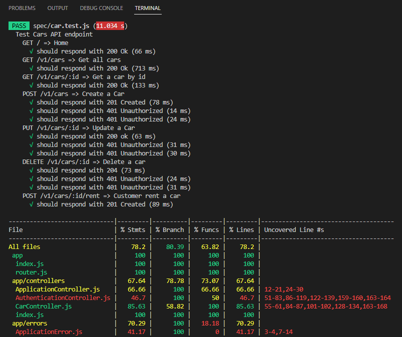

# Challenge - 08

## Result

### Test Result

- Cars API test

- Auth API test

### Overall coverage

# BCR API

Di dalam repository ini terdapat implementasi API dari Binar Car Rental.
Tugas kalian disini adalah:
1. Fork repository
2. Tulis unit test di dalam repository ini menggunakan `jest`.
3. Coverage minimal 70%

Good luck!
